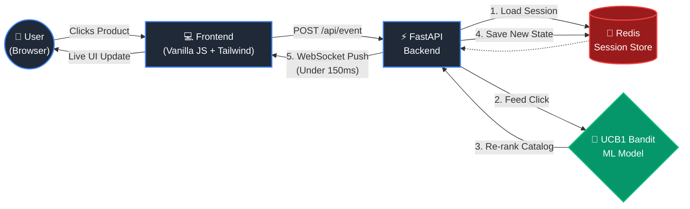

# SessionMind 🧠⚡

**Real-Time In-Session AI That Chooses Individuals, Not Audiences — At Marketer Scale**

SessionMind is a sub-150ms real-time personalization engine designed to rewrite marketing moments dynamically mid-session. It continuously re-scores and re-ranks marketing content based on live clickstream data, utilizing an online Contextual Bandit (UCB1) machine learning model. 

Instead of waiting for overnight batch processing, SessionMind responds to **this click, right now.**

## 🚀 Features
- **< 150ms Latency:** From user click to UI update via WebSocket push.
- **In-Memory Session State:** Ephemeral session handling using Redis for O(1) read/write speeds.
- **Online Learning:** UCB1 Contextual Bandit model updates reward estimates per click, perfectly demonstrating Epsilon's 1:1 personalization.
- **Scale-Ready Architecture:** Asynchronous FastAPI backend suited for high-volume behavioral event streams.

## 🏗️ System Architecture



## 🏗️ Architecture Stack
- **Backend:** Python 3.11, FastAPI, Uvicorn, websockets, numpy
- **State Store:** Redis (asyncio)
- **Frontend:** Vanilla JS, HTML5, Tailwind CSS
- **Deployment:** Render (Backend/Frontend)

## 🏃‍♂️ Run Locally (Docker)

The fastest way to test the system is using Docker Compose, which spins up both the FastAPI application and a local Redis container.

1. Clone the repository:
   ```bash
   git clone https://github.com/akash3tsm7/sessionmind.git
   cd sessionmind
   ```

2. Start the services:
   ```bash
   docker-compose up --build
   ```

3. Open your browser and navigate to:
   [http://localhost:8000](http://localhost:8000)

## 📡 Live Demo
[🔗 View the Deployed Application Here](https://sessionmind-x28c.onrender.com)

## 👤 Team
- **Akash T S M** – ML Engineering & Backend Architecture
